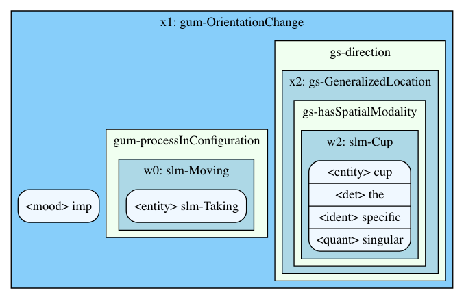

# Web OpenCCG

[](https://litmus.informatik.uni-bremen.de/jenkins/job/Web%20OpenCCG/job/master/)

This repository builds a thin python wrapper around [OpenCCG](http://openccg.sourceforge.net/) using the [GUM-space ontology](http://www.diaspace.uni-bremen.de/cgi-bin/twiki/view/DiaSpace/ReSources.html), ready to run inside a [docker](https://www.docker.com/) container.
You can find a live version at [litmus.informatik.uni-bremen.de/openccg](https://litmus.informatik.uni-bremen.de/openccg).

After an initial `docker-compose up`, the service can be queried using a simple POST request, e.g. using curl:

    $ curl --data "Take the cup." localhost/parse
    {"version": "2.2.0", "application": "web-openccg", "uuid": "3bafdaf8-cc9c-4fdf-b455-c9687babba49", "sentence": "take the cup", "parses": ..., "http_status": 200, "json_parses": ..., "graphs": ...}

Or, as an example, using Python [requests](http://docs.python-requests.org/en/master/):

```python
import requests
print(requests.post('http://localhost/parse', data={'sentence': 'Take the cup.'}).json())
```

Note that is is not production ready, as it is really slow and not optimized:
Instead of keeping one (or multiple) instances of OpenCCG running to query them faster, each request spawns an individual OpenCCG instance.

- [Usage](#usage)
    - [Querying](#querying)
    - [Response format](#response-format)
    - [JSON format](#json-format)
    - [Changing the port](#changing-the-port)
- [Development](#development)
- [Example response](#example-response)


## Usage

### Querying

To query the service visually, just open your browser at [http://localhost/](http://localhost/).
Otherwise, use curl, wget, or e.g. python requests to query web-openccg via the command line or your application.

If your client allows to build your request body manually, like curl, just put the sentence inside:

    curl --data "Take the cup." localhost/parse

However, many high level frameworks like python requests usually use a
key-value mechanism for post data. In this case, use the key `sentence`:

    requests.post('http://localhost/parse', data={'sentence': 'Take the cup.'})

For an example, see [below](#example-response).

### Response format

The response is a JSON object and always contains these fields:

- `version`: The JSON object version.
- `application`: Always "web-openccg", this is useful if you aggregate parses from different services.
- `uuid`: A unique ID for this response. This will only be useful if you plan to integrate the tool somehow.
- `http_status`: The HTTP status from the request.

If a sentence was provided during the request, these fields are present:

- `sentence`: The cleaned input sentence (all lowercase, punctuation removed, ...).

If at least one successful parse exists, the these fields are included:
- `parses`: A dictionary of parse-identifiers (e.g. "np") to actual parses as OpenCCG outputs them.
- `json_parses`: A version of the OpenCCG outputs in a flat JSON. This is produced via a custom grammar for [TatSu](https://github.com/neogeny/TatSu). For details see [below](#json-format)
- `graphs`: A dictionary of parse-identifiers to dot-strings. They can be rendered using graphviz -- the [online GUI](https://litmus.informatik.uni-bremen.de/openccg) renders these automatically.

*Note:* The keys are shared between `parses`, `json_parses`, and `graphs`, thus you can easily lookup the original output for a JSON parse and vice-versa.

If an error occurs, the error field is present:
- `error`: An error description.


### JSON format

Current version: 2.1.0

The JSON format for the OpenCCG parses can be determined from the example above
or by carefully inspecting the fully typed
[OpenCCG.ebnf](https://github.com/shoeffner/web-openccg/blob/master/OpenCCG.ebnf).

There are three different types of objects: Nominal, Variable, and Role. The full
semantic specification (the JSON file) can either be one single entity of any of the
three types or a list of Nominals. If we find parses which are lists of
variables or roles, the grammar will be extended. Please open an issue if you
find sentences which can not be parsed correctly.


#### Nominal and Variable

A nominal is like a special variable, it describes the "main theme" of the sentence.
Since they are practically the same (they actually have very similar parsing
rules), the JSON format represents them with an identical structure:

```json
{
    "__class__": "Variable",
    "name": "x1",
    "type": "gum-OrientationChange",
    "roles": []
}
```

- `__class__` is either `Variable` or `Nominal`.
- `name` is the variable named used by OpenCCG, it is a letter followed by a number, for example `x1` or `w12`.
- `type` is a [GUM](https://www.ontospace.uni-bremen.de/ontology/stable/GUM-3-space.owl) specifier denoting the type of the variable. It can also be `null`, if the type is not specified.
- `roles` is a list of roles as described below.


#### Role

A Role defines all properties a Variable or Nominal can have.
It follows a very similar structure:

```json
{
    "__class__": "Role",
    "type": "quant",
    "target": ...
}
```

- `__class__`: `Role`.
- `type`: The role type. This determines the `target` possibilities.
- `target`: The value of the role. This can be multiple different things, see below.

If the type is `entity`, the target will be an instance, like "cup" or "slm-Taking".
If the type has a prefix followed by a dash, e.g. `gs-hasSpatialModality` or `gs-direction`, then the target will be a `Variable`; in owl this would be an ObjectProperty.
If the type is any other string, the target will be an atomic string, e.g. the type `det` can have the target `the`, while the type `quant` can have the target `singular`.


### Changing the port

Most web services use port 80 as a default port, and so does web-openccg.

To change the port, adjust the docker-compose file and change the port line
from `"80:80"` to your port on the left side (but keep the 80 on the right), so
for example to set up the service on Port 9043, you would change it to
`"9043:80"`.


## Development

Although not necessarily needed, I use a pipenv for local development to be
able to compile the grammar to a parser using TatSu.
I rely on [when-changed](https://github.com/joh/when-changed) to trigger
automatic builds:

    when-changed OpenCCG.ebnf make

To start the development docker container, use the Makefile:

    make run

The development server binds to port 5000 and uses the
[flask](http://flask.pocoo.org/) debug environment. Additionally, the docker
container started with `make run` binds the app directory
so that flask's reloading works properly.


## Example response

An example response for the sentence "Take the cup." is:

```json
{
    "version": "2.2.0",
    "application": "web-openccg",
    "uuid": "ecae8222-af9b-4185-a508-efa8be33c7e6",
    "sentence": "take the cup",
    "parses": {
        "smain": "@x1:gum-OrientationChange( <mood>imp ^ <gs-direction>(x2:gs-GeneralizedLocation ^ <gs-hasSpatialModality>(w2:slm-Cup ^ cup ^ <det>the ^ <ident>specific ^ <quant>singular)) ^ <gum-processInConfiguration>(w0:slm-Moving ^ slm-Taking))",
        "smain/0": "@x1:gum-OrientationChange( <mood>imp ^ <gs-direction>(x2:gs-GeneralizedLocation ^ <gs-hasSpatialModality>(w2:slm-Cup ^ cup ^ <det>the ^ <ident>specific ^ <quant>singular)) ^ <gum-processInConfiguration>(w0:slm-Taking ^ slm-Taking))",
        "smain/.r": "@x1:gs-AffectingDirectedMotion( <mood>imperative ^ <gs-route>x2 ^ <gum-actee>(w2:slm-Cup ^ cup ^ <det>the ^ <ident>specific ^ <quant>singular) ^ <gum-processInConfiguration>(w0:slm-Moving ^ slm-Taking))",
        "smain/.r/0": "@x1:gs-AffectingDirectedMotion( <mood>imperative ^ <gs-route>x2 ^ <gum-actee>(w2:slm-Cup ^ cup ^ <det>the ^ <ident>specific ^ <quant>singular) ^ <gum-processInConfiguration>(w0:slm-Taking ^ slm-Taking))"
    },
    "http_status": 200,
    "json_parses": {
        "smain": {
            "__class__": "Nominal",
            "type": "gum-OrientationChange",
            "name": "x1",
            "roles": [
                {
                    "__class__": "Role",
                    "type": "mood",
                    "target": "imp"
                },
                {
                    "__class__": "Role",
                    "type": "gs-direction",
                    "target": {
                        "__class__": "Variable",
                        "type": "gs-GeneralizedLocation",
                        "name": "x2",
                        "roles": [
                            {
                                "__class__": "Role",
                                "type": "gs-hasSpatialModality",
                                "target": {
                                    "__class__": "Variable",
                                    "type": "slm-Cup",
                                    "name": "w2",
                                    "roles": [
                                        {
                                            "__class__": "Role",
                                            "type": "entity",
                                            "target": "cup"
                                        },
                                        {
                                            "__class__": "Role",
                                            "type": "det",
                                            "target": "the"
                                        },
                                        {
                                            "__class__": "Role",
                                            "type": "ident",
                                            "target": "specific"
                                        },
                                        {
                                            "__class__": "Role",
                                            "type": "quant",
                                            "target": "singular"
                                        }
                                    ]
                                }
                            }
                        ]
                    }
                },
                {
                    "__class__": "Role",
                    "type": "gum-processInConfiguration",
                    "target": {
                        "__class__": "Variable",
                        "type": "slm-Moving",
                        "name": "w0",
                        "roles": [
                            {
                                "__class__": "Role",
                                "type": "entity",
                                "target": "slm-Taking"
                            }
                        ]
                    }
                }
            ]
        },
        "smain/0": {
            "__class__": "Nominal",
            "type": "gum-OrientationChange",
            "name": "x1",
            "roles": [
                {
                    "__class__": "Role",
                    "type": "mood",
                    "target": "imp"
                },
                {
                    "__class__": "Role",
                    "type": "gs-direction",
                    "target": {
                        "__class__": "Variable",
                        "type": "gs-GeneralizedLocation",
                        "name": "x2",
                        "roles": [
                            {
                                "__class__": "Role",
                                "type": "gs-hasSpatialModality",
                                "target": {
                                    "__class__": "Variable",
                                    "type": "slm-Cup",
                                    "name": "w2",
                                    "roles": [
                                        {
                                            "__class__": "Role",
                                            "type": "entity",
                                            "target": "cup"
                                        },
                                        {
                                            "__class__": "Role",
                                            "type": "det",
                                            "target": "the"
                                        },
                                        {
                                            "__class__": "Role",
                                            "type": "ident",
                                            "target": "specific"
                                        },
                                        {
                                            "__class__": "Role",
                                            "type": "quant",
                                            "target": "singular"
                                        }
                                    ]
                                }
                            }
                        ]
                    }
                },
                {
                    "__class__": "Role",
                    "type": "gum-processInConfiguration",
                    "target": {
                        "__class__": "Variable",
                        "type": "slm-Taking",
                        "name": "w0",
                        "roles": [
                            {
                                "__class__": "Role",
                                "type": "entity",
                                "target": "slm-Taking"
                            }
                        ]
                    }
                }
            ]
        },
        "smain/.r": {
            "__class__": "Nominal",
            "type": "gs-AffectingDirectedMotion",
            "name": "x1",
            "roles": [
                {
                    "__class__": "Role",
                    "type": "mood",
                    "target": "imperative"
                },
                {
                    "__class__": "Role",
                    "type": "gs-route",
                    "target": {
                        "__class__": "Variable",
                        "type": null,
                        "name": "x2",
                        "roles": [
                            {
                                "__class__": "Role",
                                "type": "gum-actee",
                                "target": {
                                    "__class__": "Variable",
                                    "type": "slm-Cup",
                                    "name": "w2",
                                    "roles": [
                                        {
                                            "__class__": "Role",
                                            "type": "entity",
                                            "target": "cup"
                                        },
                                        {
                                            "__class__": "Role",
                                            "type": "det",
                                            "target": "the"
                                        },
                                        {
                                            "__class__": "Role",
                                            "type": "ident",
                                            "target": "specific"
                                        },
                                        {
                                            "__class__": "Role",
                                            "type": "quant",
                                            "target": "singular"
                                        }
                                    ]
                                }
                            },
                            {
                                "__class__": "Role",
                                "type": "gum-processInConfiguration",
                                "target": {
                                    "__class__": "Variable",
                                    "type": "slm-Moving",
                                    "name": "w0",
                                    "roles": [
                                        {
                                            "__class__": "Role",
                                            "type": "entity",
                                            "target": "slm-Taking"
                                        }
                                    ]
                                }
                            }
                        ]
                    }
                }
            ]
        },
        "smain/.r/0": {
            "__class__": "Nominal",
            "type": "gs-AffectingDirectedMotion",
            "name": "x1",
            "roles": [
                {
                    "__class__": "Role",
                    "type": "mood",
                    "target": "imperative"
                },
                {
                    "__class__": "Role",
                    "type": "gs-route",
                    "target": {
                        "__class__": "Variable",
                        "type": null,
                        "name": "x2",
                        "roles": [
                            {
                                "__class__": "Role",
                                "type": "gum-actee",
                                "target": {
                                    "__class__": "Variable",
                                    "type": "slm-Cup",
                                    "name": "w2",
                                    "roles": [
                                        {
                                            "__class__": "Role",
                                            "type": "entity",
                                            "target": "cup"
                                        },
                                        {
                                            "__class__": "Role",
                                            "type": "det",
                                            "target": "the"
                                        },
                                        {
                                            "__class__": "Role",
                                            "type": "ident",
                                            "target": "specific"
                                        },
                                        {
                                            "__class__": "Role",
                                            "type": "quant",
                                            "target": "singular"
                                        }
                                    ]
                                }
                            },
                            {
                                "__class__": "Role",
                                "type": "gum-processInConfiguration",
                                "target": {
                                    "__class__": "Variable",
                                    "type": "slm-Taking",
                                    "name": "w0",
                                    "roles": [
                                        {
                                            "__class__": "Role",
                                            "type": "entity",
                                            "target": "slm-Taking"
                                        }
                                    ]
                                }
                            }
                        ]
                    }
                }
            ]
        }
    },
    "graphs": {
        "smain": "strict graph \"\" {\n\tnode [label=\"\\N\"];\n\tsubgraph cluster_x1 {\n\t\tgraph [fillcolor=lightskyblue,\n\t\t\tlabel=\"x1: gum-OrientationChange\",\n\t\t\tstyle=filled\n\t\t];\n\t\tsubgraph \"cluster_gs-direction\" {\n\t\t\tgraph [fillcolor=honeydew,\n\t\t\t\tlabel=\"gs-direction\",\n\t\t\t\tstyle=filled\n\t\t\t];\n\t\t\tsubgraph cluster_x2 {\n\t\t\t\tgraph [fillcolor=lightblue,\n\t\t\t\t\tlabel=\"x2: gs-GeneralizedLocation\",\n\t\t\t\t\tstyle=filled\n\t\t\t\t];\n\t\t\t\tsubgraph \"cluster_gs-hasSpatialModality\" {\n\t\t\t\t\tgraph [fillcolor=honeydew,\n\t\t\t\t\t\tlabel=\"gs-hasSpatialModality\",\n\t\t\t\t\t\tstyle=filled\n\t\t\t\t\t];\n\t\t\t\t\tsubgraph cluster_w2 {\n\t\t\t\t\t\tgraph [fillcolor=lightblue,\n\t\t\t\t\t\t\tlabel=\"w2: slm-Cup\",\n\t\t\t\t\t\t\tstyle=filled\n\t\t\t\t\t\t];\n\t\t\t\t\t\tw2\t\t\t\t\t\t [fillcolor=aliceblue,\n\t\t\t\t\t\t\tlabel=\"{&lt;entity&gt; cup|&lt;det&gt; the|&lt;ident&gt; specific|&lt;quant&gt; singular}\",\n\t\t\t\t\t\t\tshape=Mrecord,\n\t\t\t\t\t\t\tstyle=filled];\n\t\t\t\t\t}\n\t\t\t\t}\n\t\t\t}\n\t\t}\n\t\tsubgraph \"cluster_gum-processInConfiguration\" {\n\t\t\tgraph [fillcolor=honeydew,\n\t\t\t\tlabel=\"gum-processInConfiguration\",\n\t\t\t\tstyle=filled\n\t\t\t];\n\t\t\tsubgraph cluster_w0 {\n\t\t\t\tgraph [fillcolor=lightblue,\n\t\t\t\t\tlabel=\"w0: slm-Moving\",\n\t\t\t\t\tstyle=filled\n\t\t\t\t];\n\t\t\t\tw0\t\t\t\t [fillcolor=aliceblue,\n\t\t\t\t\tlabel=\"{&lt;entity&gt; slm-Taking}\",\n\t\t\t\t\tshape=Mrecord,\n\t\t\t\t\tstyle=filled];\n\t\t\t}\n\t\t}\n\t\tx1\t\t [fillcolor=aliceblue,\n\t\t\tlabel=\"{&lt;mood&gt; imp}\",\n\t\t\tshape=Mrecord,\n\t\t\tstyle=filled];\n\t}\n}\n",
        "smain/0": "strict graph \"\" {\n\tnode [label=\"\\N\"];\n\tsubgraph cluster_x1 {\n\t\tgraph [fillcolor=lightskyblue,\n\t\t\tlabel=\"x1: gum-OrientationChange\",\n\t\t\tstyle=filled\n\t\t];\n\t\tsubgraph \"cluster_gs-direction\" {\n\t\t\tgraph [fillcolor=honeydew,\n\t\t\t\tlabel=\"gs-direction\",\n\t\t\t\tstyle=filled\n\t\t\t];\n\t\t\tsubgraph cluster_x2 {\n\t\t\t\tgraph [fillcolor=lightblue,\n\t\t\t\t\tlabel=\"x2: gs-GeneralizedLocation\",\n\t\t\t\t\tstyle=filled\n\t\t\t\t];\n\t\t\t\tsubgraph \"cluster_gs-hasSpatialModality\" {\n\t\t\t\t\tgraph [fillcolor=honeydew,\n\t\t\t\t\t\tlabel=\"gs-hasSpatialModality\",\n\t\t\t\t\t\tstyle=filled\n\t\t\t\t\t];\n\t\t\t\t\tsubgraph cluster_w2 {\n\t\t\t\t\t\tgraph [fillcolor=lightblue,\n\t\t\t\t\t\t\tlabel=\"w2: slm-Cup\",\n\t\t\t\t\t\t\tstyle=filled\n\t\t\t\t\t\t];\n\t\t\t\t\t\tw2\t\t\t\t\t\t [fillcolor=aliceblue,\n\t\t\t\t\t\t\tlabel=\"{&lt;entity&gt; cup|&lt;det&gt; the|&lt;ident&gt; specific|&lt;quant&gt; singular}\",\n\t\t\t\t\t\t\tshape=Mrecord,\n\t\t\t\t\t\t\tstyle=filled];\n\t\t\t\t\t}\n\t\t\t\t}\n\t\t\t}\n\t\t}\n\t\tsubgraph \"cluster_gum-processInConfiguration\" {\n\t\t\tgraph [fillcolor=honeydew,\n\t\t\t\tlabel=\"gum-processInConfiguration\",\n\t\t\t\tstyle=filled\n\t\t\t];\n\t\t\tsubgraph cluster_w0 {\n\t\t\t\tgraph [fillcolor=lightblue,\n\t\t\t\t\tlabel=\"w0: slm-Taking\",\n\t\t\t\t\tstyle=filled\n\t\t\t\t];\n\t\t\t\tw0\t\t\t\t [fillcolor=aliceblue,\n\t\t\t\t\tlabel=\"{&lt;entity&gt; slm-Taking}\",\n\t\t\t\t\tshape=Mrecord,\n\t\t\t\t\tstyle=filled];\n\t\t\t}\n\t\t}\n\t\tx1\t\t [fillcolor=aliceblue,\n\t\t\tlabel=\"{&lt;mood&gt; imp}\",\n\t\t\tshape=Mrecord,\n\t\t\tstyle=filled];\n\t}\n}\n",
        "smain/.r": "strict graph \"\" {\n\tnode [label=\"\\N\"];\n\tsubgraph cluster_x1 {\n\t\tgraph [fillcolor=lightskyblue,\n\t\t\tlabel=\"x1: gs-AffectingDirectedMotion\",\n\t\t\tstyle=filled\n\t\t];\n\t\tsubgraph \"cluster_gs-route\" {\n\t\t\tgraph [fillcolor=honeydew,\n\t\t\t\tlabel=\"gs-route\",\n\t\t\t\tstyle=filled\n\t\t\t];\n\t\t\tsubgraph cluster_x2 {\n\t\t\t\tgraph [fillcolor=lightblue,\n\t\t\t\t\tlabel=None,\n\t\t\t\t\tstyle=filled\n\t\t\t\t];\n\t\t\t\tsubgraph \"cluster_gum-actee\" {\n\t\t\t\t\tgraph [fillcolor=honeydew,\n\t\t\t\t\t\tlabel=\"gum-actee\",\n\t\t\t\t\t\tstyle=filled\n\t\t\t\t\t];\n\t\t\t\t\tsubgraph cluster_w2 {\n\t\t\t\t\t\tgraph [fillcolor=lightblue,\n\t\t\t\t\t\t\tlabel=\"w2: slm-Cup\",\n\t\t\t\t\t\t\tstyle=filled\n\t\t\t\t\t\t];\n\t\t\t\t\t\tw2\t\t\t\t\t\t [fillcolor=aliceblue,\n\t\t\t\t\t\t\tlabel=\"{&lt;entity&gt; cup|&lt;det&gt; the|&lt;ident&gt; specific|&lt;quant&gt; singular}\",\n\t\t\t\t\t\t\tshape=Mrecord,\n\t\t\t\t\t\t\tstyle=filled];\n\t\t\t\t\t}\n\t\t\t\t}\n\t\t\t\tsubgraph \"cluster_gum-processInConfiguration\" {\n\t\t\t\t\tgraph [fillcolor=honeydew,\n\t\t\t\t\t\tlabel=\"gum-processInConfiguration\",\n\t\t\t\t\t\tstyle=filled\n\t\t\t\t\t];\n\t\t\t\t\tsubgraph cluster_w0 {\n\t\t\t\t\t\tgraph [fillcolor=lightblue,\n\t\t\t\t\t\t\tlabel=\"w0: slm-Moving\",\n\t\t\t\t\t\t\tstyle=filled\n\t\t\t\t\t\t];\n\t\t\t\t\t\tw0\t\t\t\t\t\t [fillcolor=aliceblue,\n\t\t\t\t\t\t\tlabel=\"{&lt;entity&gt; slm-Taking}\",\n\t\t\t\t\t\t\tshape=Mrecord,\n\t\t\t\t\t\t\tstyle=filled];\n\t\t\t\t\t}\n\t\t\t\t}\n\t\t\t}\n\t\t}\n\t\tx1\t\t [fillcolor=aliceblue,\n\t\t\tlabel=\"{&lt;mood&gt; imperative}\",\n\t\t\tshape=Mrecord,\n\t\t\tstyle=filled];\n\t}\n}\n",
        "smain/.r/0": "strict graph \"\" {\n\tnode [label=\"\\N\"];\n\tsubgraph cluster_x1 {\n\t\tgraph [fillcolor=lightskyblue,\n\t\t\tlabel=\"x1: gs-AffectingDirectedMotion\",\n\t\t\tstyle=filled\n\t\t];\n\t\tsubgraph \"cluster_gs-route\" {\n\t\t\tgraph [fillcolor=honeydew,\n\t\t\t\tlabel=\"gs-route\",\n\t\t\t\tstyle=filled\n\t\t\t];\n\t\t\tsubgraph cluster_x2 {\n\t\t\t\tgraph [fillcolor=lightblue,\n\t\t\t\t\tlabel=None,\n\t\t\t\t\tstyle=filled\n\t\t\t\t];\n\t\t\t\tsubgraph \"cluster_gum-actee\" {\n\t\t\t\t\tgraph [fillcolor=honeydew,\n\t\t\t\t\t\tlabel=\"gum-actee\",\n\t\t\t\t\t\tstyle=filled\n\t\t\t\t\t];\n\t\t\t\t\tsubgraph cluster_w2 {\n\t\t\t\t\t\tgraph [fillcolor=lightblue,\n\t\t\t\t\t\t\tlabel=\"w2: slm-Cup\",\n\t\t\t\t\t\t\tstyle=filled\n\t\t\t\t\t\t];\n\t\t\t\t\t\tw2\t\t\t\t\t\t [fillcolor=aliceblue,\n\t\t\t\t\t\t\tlabel=\"{&lt;entity&gt; cup|&lt;det&gt; the|&lt;ident&gt; specific|&lt;quant&gt; singular}\",\n\t\t\t\t\t\t\tshape=Mrecord,\n\t\t\t\t\t\t\tstyle=filled];\n\t\t\t\t\t}\n\t\t\t\t}\n\t\t\t\tsubgraph \"cluster_gum-processInConfiguration\" {\n\t\t\t\t\tgraph [fillcolor=honeydew,\n\t\t\t\t\t\tlabel=\"gum-processInConfiguration\",\n\t\t\t\t\t\tstyle=filled\n\t\t\t\t\t];\n\t\t\t\t\tsubgraph cluster_w0 {\n\t\t\t\t\t\tgraph [fillcolor=lightblue,\n\t\t\t\t\t\t\tlabel=\"w0: slm-Taking\",\n\t\t\t\t\t\t\tstyle=filled\n\t\t\t\t\t\t];\n\t\t\t\t\t\tw0\t\t\t\t\t\t [fillcolor=aliceblue,\n\t\t\t\t\t\t\tlabel=\"{&lt;entity&gt; slm-Taking}\",\n\t\t\t\t\t\t\tshape=Mrecord,\n\t\t\t\t\t\t\tstyle=filled];\n\t\t\t\t\t}\n\t\t\t\t}\n\t\t\t}\n\t\t}\n\t\tx1\t\t [fillcolor=aliceblue,\n\t\t\tlabel=\"{&lt;mood&gt; imperative}\",\n\t\t\tshape=Mrecord,\n\t\t\tstyle=filled];\n\t}\n}\n"
    }
}
```

Example visualization (only smain shown):


